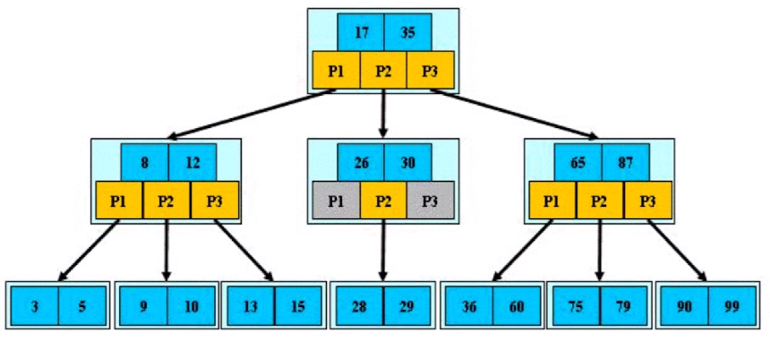
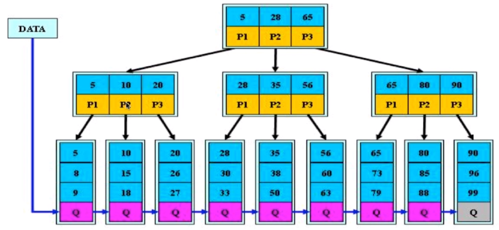
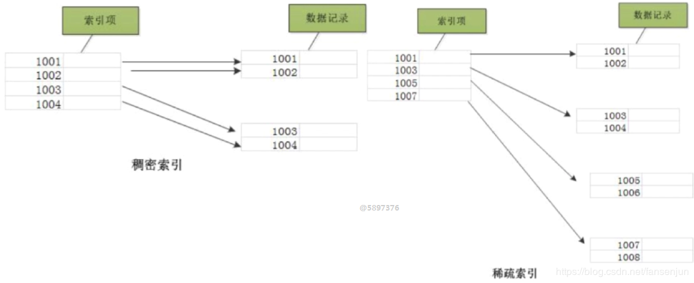
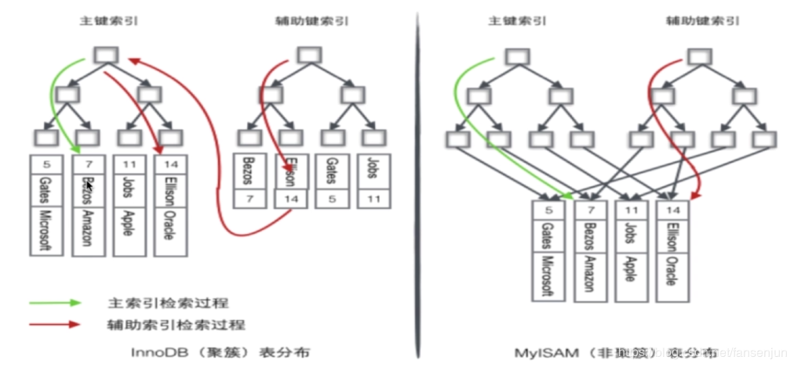
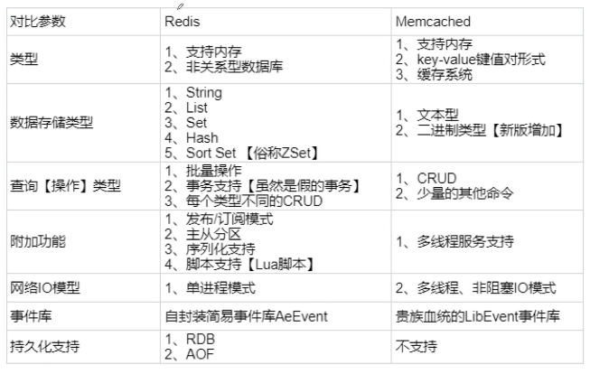
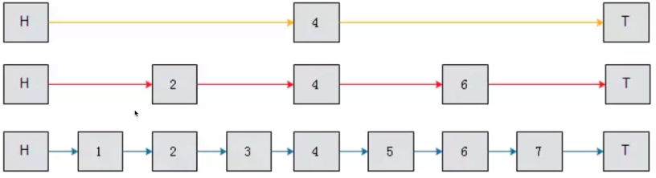
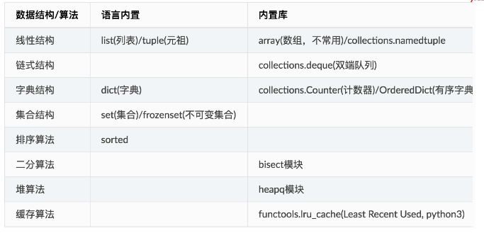

## 1. mysql

### 1.1 B-Tree

- `B-Tree` 的特点(如下为3阶B树)
- **阶数：**树中所有孩子结点个数的最大值称为该树的阶



1. 根节点至少包括两个孩子

2. 树中的每个节点最多包含有m个孩子(m>=2)，m为树的阶数，也就是说极端情况下为二叉树

3. 除根节点和叶子节点外，其它每个节点至少含有ceil(m/2)个节点，ceil为向上取整

4. 所有叶子节点都位于同一层

5. 假设每个非终端节点中包含有n个关键字信息，其中

   a. `k_i(i=1...n)` 为关键字，且关键字按顺序升序排序`k_(i-1)<k_i`

   b. 关键字的个数n必须满足：`[ceil(m/2)-1] <=n<=m-1`

   c. 非叶子节点的指针`P[1],P[2]...P[M]`，其中`P[1]`指向关键字小于`K[1]`的子树，`P[M]`指向关键字大于`K[M-1]`的子树，其它关键字指向`(k_[i-1],k[i])`的子树

### 1.2B+-Tree



**B+树是B树的变体，其基本定义与B树相同除了：**

1. 非叶子节点的指针数与节点的关键字的个数相同
2. 非叶子节点的子树指针P[i]，指向关键字值[k[i],k[i+1])的子树
3. 非叶子节点仅用来作为索引数据都保存在叶子节点里面
4. 所有叶子节点均有一个链指针指向下一个叶子节点（适合用来做范围统计）

**结论：B+树更适合用来作为索引**

1. `B+` 树的磁盘读写代价更低（由于B+树非叶子节点仅仅用来存储索引，这样可以在使用的时候将索引和数据分别存储于不同的盘区，由于索引数据量较少可以一次性读取所有索引的数据，再进行定位数据）

2. `B+`树的查询效率更加稳定

   由于内部结点并不是最终指向文件内容的结点，而只是叶子结点中关键字的索引。所以任何关键字的查找必须走一条从根结点到叶子结点的路。所有关键字查询的路径长度相同，导致每一个数据的查询效率相当。

3. B+树更有利于对于数据库的扫描和范围查询

   B树在提高了磁盘IO性能的同时并没有解决元素遍历的效率低下的问题，而B+树只需要遍历叶子节点就可以解决对全部关键字信息的扫描，所以对于数据库中频繁使用的range query，B+树有着更高的性能。

### 1.3 索引模块

- 密集索引文件中的每个搜索码值都对应一个索引值
- 稀疏索引文件只为索引码的某些值建立索引项



密集索引的定义：叶子节点保存的不只是键值，还保存了位于同一行记录里的其他列的信息，由于密集索引决定了表的物理排列顺序，一个表只有一个物理排列顺序，所以一个表只能创建一个密集索引

稀疏索引：叶子节点仅保存了键位信息以及该行数据的地址，有的稀疏索引只保存了键位信息机器主键

`myIsam`存储引擎，不管是主键索引，唯一键索引还是普通索引都是稀疏索引

`innodb`存储引擎：有且只有一个密集索引。密集索引的选取规则如下：

- 若主键被定义，则主键作为密集索引
- 如果没有主键被定义，该表的第一个唯一非空索引则作为密集索引
- 若不满足以上条件，innodb内部会生成一个隐藏主键（密集索引）
- 非主键索引存储相关键位和其对应的主键值，包含两次查找（1.通过辅助索引找到主键索引；2.通过主键索引找到具体数据）

PS:myIsam的索引和数据存放在不同文件中(`.MYI,.MYD`)，而`innodb`的存放在同意文件中(`.idb`)



## 2.WEB安全

### 2.1 SQL注入

**SQL注入与防范**

- 通过构造特殊的输入参数传入web应用，直接导致后端执行了恶意`SQL`

- 通常由于程序员未对于输入进行过滤，直接动态拼接SQL产生

- 可以使用开源工具`sqlmap`， `SQLninja` 检测

**案例**

```sql
-- 创建表
CREATE TABLE `USER` (
`id` int NOT NULL AUTO_INCREMENT,
`name` VARCHAR(45) NULL,
`email` VARCHAR(45) NULL,
`password` VARCHAR(45) NULL,
PRIMARY KEY(`id`)
);

-- 插入数据
INSERT INTO user(name,email,password) values(
'lisi', 'lisi@gmail.com',md5('lisi123')
);
```

- python代码

```python
import MySQLdb

db = MySQLdb.connect(host="127.0.0.1", user='root', passwd='123456', db='demo')
cur = db.cursor()
name = input("Enter Name: ")
print('您输入的用户name是{name}'.format(name=name))
password = input('Enter password: ')
print('您输入的密码是：{password}'.format(password=password))
# 直接拼接SQL
# sql = "select * from user where name = '" + name + "' and password = md5('" + password + "')"
sql = "select * from user where name = '{name}' and password = md5('{password}')".\
    format(name=name, password=password)
print(sql)
cur.execute(sql)
for row in cur.fetchall():
    print(row)

```

- 直接拼接SQL的输出结果

```shell
Enter Name: lisi ' -- '
您输入的用户name是lisi ' -- '
Enter password: 123
您输入的密码是：123
select * from user where name = 'lisi ' -- '' and password = md5('123')
(1, 'lisi', 'lisi@gmail.com', 'c3cb6d12c40908943b64bc0681af47db')
```

- 采用字符替换的输出结果

```python
您输入的用户name是lisi ' -- '
Enter password: 123
您输入的密码是：123
select * from user where name = 'lisi ' -- '' and password = md5('123')
(1, 'lisi', 'lisi@gmail.com', 'c3cb6d12c40908943b64bc0681af47db')

```

**如何防范SQL注入**

**web安全一大原则：永远不要相信用户的输入**

- 对于输入参数做好类型检查，过滤和转义特殊字符
- 不要直接拼接SQL，使用ORM可以大大降低SQL注入风险
- 数据库底层：做好权限管理配置；不要明文存储敏感信息（密码）

### 2.2 XSS攻击

**XSS（Cross Site Scripting）跨站脚本攻击**

- 恶意用户将未进行转义的代码植入到提供给其他用户使用的页面中，未经转义的恶意代码输出到其他用户的浏览器被执行
- 用户浏览页面的时候嵌入页面的脚本(js)会被执行，对于用户进行攻击
- 主要分为两类：反射型（非持久型）、存储型（持久型）

**XSS危害**

- 盗用用户的cookie，获取敏感信息
- 利用私人账号执行一些违法操作，比如盗取个人或者商业资料，执行一些隐私操作
- 甚至可以在一些访问量很大的网站上实现DDoS攻击

**XSS防范**

- 过滤。对于`<script>  <a>` 等进行过滤
- 转义。对常见符号`(&、<、>)` 进行转义(`python3 html.escape`)
- 后端设置`httpOnly`禁止浏览器访问和操作`Document.cookie`

```python
a = html.escape('<script>')
a # '&lt;script&gt;'
```

### 2.3 什么是CSRF?

**CSRF:Cross-site request forgery（跨站请求伪造）**

- 利用网站对于已认证用户的权限去执行为授权命令的一种恶意攻击
- 攻击者会盗用你的登录信息，以你的身份发起请求
- web身份认证机制只能识别一个请求是否来自某个用户的浏览器，但无法保证请求时用户自己或批准发送的


**CSRF产生条件**

- 受害者已经登录到目标网站并且没有退出（保持登录状态）
- 受害者访问了攻击者发布的链接或者表单
- 二者缺一不可

**如何防范CSRF**

- 不要在get请求里面有任何数据修改的操作
- 令牌同步(`Synchronized token pattern`， 简称`STP`)：在用户请求的表单里面嵌入一个隐藏的`csrf_token`，服务端验证其是否与`cookie`中的一致（基于同源策略其他网站是无法获取`cookie`中的`csrf_token`） 黑客是拿不到你cookie中的scrftoken值得，前提是网站本身没有XSS漏洞
- 如果是js提交需要先从`cookie`获取`csrf_token`作为`X-CSRFToken`请求头提交
- 其他：检查来源`HTTP Referer`(容易被伪造)；验证码方式（安全但是繁琐）

原理参考：`http://webpy.org/cookbook/csrf`


## 3.redis

### 3.1 什么是缓存？为什么要使用缓存？

- 缓解关系型数据库（常见的是`Mysql`）并发访问的压力：热点数据
- 减少响应时间：内存IO速度比磁盘快
- 提升吞吐量：Redis等内存数据库单机就可以支撑很大的并发

### 3.2 `Redis`和`Memcached`主要差别?



### 3.3 请简述redis常用数据类型和使用场景？

- `String(字符串)`：用来实现简单的KV键值存储，比如计数器
- `List(双向队列)`：可以用来存储用户的关注或者粉丝列表
- `Hash`（哈希表）：用来存储彼此相关信息的键值对
- `Set`（集合）：存储不重复元素，比如用户的关注者
- `Sorted Set`（有序集合）：实时信息排行榜，通过`score`值进行排序

### 3.4 `Redis`内置实现

- `String`：整数或者`sds(Simple Dynamic String)`

- `List`：`ziplist`或者`double linked list`

  PS：`ziplist`是通过一个连续内块实现`list`结构，其中每个`entry`节点头部保存前后节点长度信息，实现双向链表功能

- `Hash`：`ziplist` 和`hashtable`

- `Set`：`intset`或者`hashtable`

- `SortedSet`：`skiplist跳跃表`

**skiplist实现**



### 3.5什么是redis事务？

**和Mysql的事务有什么不同？**

- 将多个请求打包，一次性、按顺序执行多个命令的机制
- `Redis`通过`MULTI`，`EXEC`,`WATCH`,`DISCARD` 等命令实现事务
- `Python redis-py pipeline=conn.pipeline(transaction=True)`

### 3.6使用的缓存模式？
- `Cache Aside：`同时更新缓存和数据库，首先去缓存中获取数据，缓存中没有再去数据库里面拿数据，然后将数据更新到缓存。
  - 问题：数据一致性问题
  - 先更新数据库后更新缓存，并发写操作的时候可能导致缓存读取的是脏数据
  - 一般先更新数据库，等到数据读取的时候再去更新缓存
- `Read/Write Through`：先更新缓存，缓存负责同步更新数据库
- `Write Behind Caching：`先更新缓存缓存定期异步更新数据库

### 3.7如何解决缓存穿透问题？

**大量查询不到的数据的请求落到后端数据库，数据库压力增大**

- 由于大量缓存查不到就去数据库取，数据库也没有要查的数据
  - 很多无脑爬虫通过自增`id`的方式爬取网站，网站查不到相关的`id`数据
  - 解决：对于没查到返回为None的数据也缓存
  - 插入时删除缓存，或者为为None的缓存设置超时时间

### 3.8 如何解决缓存击穿问题？

**某些非常热点的数据`key`过期，大量请求打到后端数据库**

- 热点数据`key`失效导致大量请求大道后端数据库增加数据库压力
- 分布式锁：获取锁的线程从数据库拉数据更新缓存，其他线程等待
- 异步后台更新：后台任务对过期的`key`自动刷新

### 3.9 如何解决缓存雪崩问题？

**缓存（缓存服务器挂了）不可用或者大量缓存`key`同时失效，大量请求直接打到数据库**

- 多级缓存：不同级别的`key`设置不同的超时时间
- 随机超时：`key`的超时时间随机设置，防止同时超时
- 架构层：提升系统可用性。监控、报警完善

## 4. web框架和wsgi

### 4.1什么wsgi？

- `Python Web Server Gateway Interface(pep3333)`
- 描述了`Web Server（Gunicorn/uwsgi）`如何与`web`框架`(Flask/Django)`交互，`Web` 框架如何处理请求

`def application(environ, start_response)`

- application就是WSGI app一个可调用对象
- 参数
  - environ：一个包含`WSGI`环境信息的字典，由`WSGI`服务器提供，常见的`key`有`PATH_INFO,QUERY_STRING`等
  - start_reponse：生成WSGI响应的回调函数，接收两个参数`status`和`headers`
- 函数返回响应体的可迭代对象

```python
from wsgiref.simple_server import make_server


def my_app(environ, start_response):
    print(environ['QUERY_STRING'])
    status = '200 OK'
    headers = [('Content-Type', 'text/html; charset=utf8')]
    start_response(status, headers)
    return [b'<h1>Hello world</h1>']  # 可迭代对象


if __name__ == '__main__':
    httpd = make_server('127.0.0.1', 8888, my_app)
    httpd.serve_forever()
```

### 4.2常用的`Python Web`框架`Django/Flask/Tornado` 对比

### 4.3Web框架的组成（淡化框架，加强基础）

## 5.python2和python3的差异

### 5.1python3改进

- print成为函数
- 编码问题，Python3不再有Unicode对象，默认str就是unicode
- 除法变化，python3除法默认返回浮点数
- 类型注解(`type hint`)。帮助IDE实现类型检查
- 优化的`super()`方便直接调用父类函数
- 高级解包操作。`a,b,*rest = range(10)`
- `Keyword only arguments`。限定关键字参数
- `Chained Exceptions`。`Python 3`重新抛出异常不会丢失栈信息
- 一切返回迭代器`range,zip,map,dict.values,etc.are all iterators`。

## 6.Python内置数据结构算法



### 1.LRU算法

## 7.系统设计

### 1.短网址系统设计与实现

```sql
CREATE TABLE short_url(
id bigint unsigned NOT NULL AUTO_INCREMENT,
token varchar(10),
url varchar(2048),
created_at timestamp not null default CURRENT_TIMESTAMP,
key `idx_token`(`token`)
)
```

- 简单实现

```python
from string import ascii_letters, digits

from flask import Flask, jsonify, render_template, request
from flask_mysqldb import MySQL
from flask_redis import FlaskRedis

app = Flask(__name__)
app.config['MYSQL_USER'] = 'root'
app.config['MYSQL_PASSWORD'] = '123456'
app.config['MYSQL_DB'] = 'test'
app.config['MYSQL_CURSORCLASS'] = 'DictCursor'

mysql = MySQL(app)
redis_store = FlaskRedis(app)

CHARS = ascii_letters + digits


def encode(num: int) -> 'str':
    if num == 0:
        return CHARS[0]
    res = []
    while num:
        num, rem = divmod(num, len(CHARS))
        res.append(CHARS[rem])
    return ''.join(reversed(res))


@app.route('/shorten', methods=['POST'])
def shorten_url():
    long_url = request.json['url']
    index = int(redis_store.incr('SHORT_CNT'))
    token = encode(index)
    sql = "INSERT INTO short_url(token, url) VALUES (%s, %s)"
    cur = mysql.connection.cursor()
    cur.execute(sql, (token, long_url))
    mysql.connection.commit()
    short_url = 'http://short.com/' + token
    return jsonify(url=short_url)


if __name__ == '__main__':
    app.run()
```


### 2.抢红包系统设计与实现

### 3.秒杀系统

### 4.评论系统


